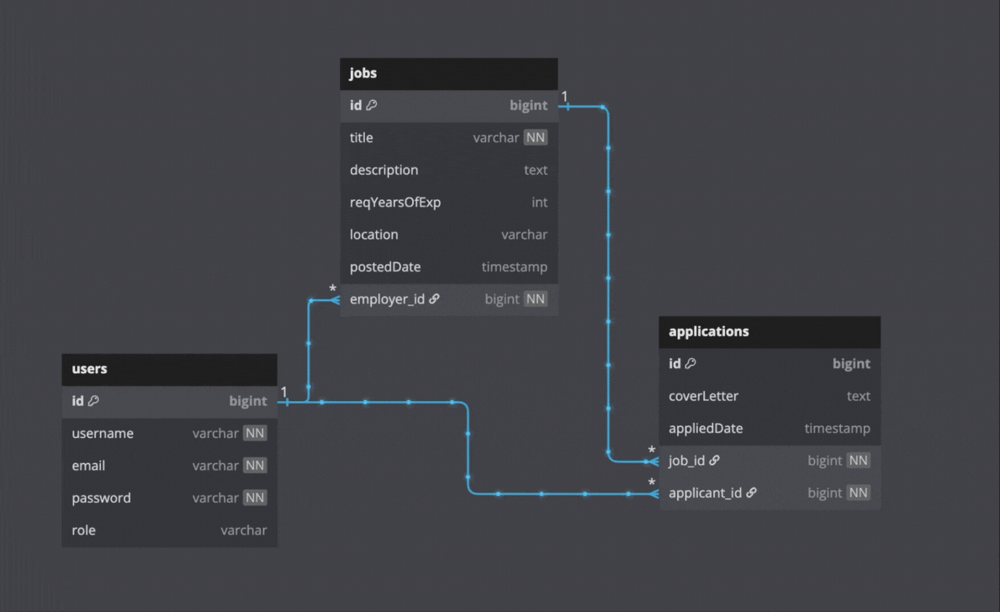

# Job Portal System

## Project Overview

This project is a **Job Portal** that connects employers with job seekers while ensuring secure role-based access. It features three user roles:

- **Employer**:
    - Can perform CRUD operations on their own job postings (Create, Read, Update, Delete).
    - Cannot access or modify other employers' job postings.

- **Job Seeker**:
    - Can apply for job openings and manage their own applications.
    - Cannot view or edit other job seekers' applications.

- **Admin**:
    - Can view all employers, job seekers, job postings, and applications.

To ensure security, **JWT authentication with Spring Security** is implemented for protected routes, maintaining data privacy and controlled access.  


### API Endpoints and Role Permissions

| All Endpoints                                                                    | ADMIN | EMPLOYER | JOB_SEEKER |
|----------------------------------------------------------------------------------|:-----:|:--------:|:---------:|
| **Register a new user** `POST /api/auth/signup?role=<role_type>`                 | ✅    | ✅       | ✅        |
| **User login** `POST /api/auth/login?role=<role_type>`                           | ✅    | ✅       | ✅        |
| **Fetch users by role** `GET /api/users?role=<role_type>`                        | ✅    | ❌       | ❌        |
| **Register a new job posting** `POST /api/jobs`                                  | ❌    | ✅       | ❌        |
| **Get all jobs posted by present employer** `GET /api/jobs`                      | ✅    | ✅       | ❌        |
| **Update job details** `PATCH /api/jobs/{jobId}`                                 | ❌    | ✅       | ❌        |
| **Delete a job posting** `DELETE /api/jobs/{jobId}`                              | ✅    | ✅       | ❌        |
| **Register a new application** `POST /api/applications`                          | ❌    | ❌       | ✅        |
| **Get all applications submitted by present job seeker** `GET /api/applications` | ✅ | ❌ | ✅ |
| **Update application details** `PATCH /api/applications/{applicationId}`         | ❌ | ❌ | ✅ |
| **Delete an application** `DELETE /api/applications/{applicationId}`             | ✅ | ❌ | ✅ |


### ER diagram for Job Portal system




## 2. System Requirements

- Java: Version 17 or higher
- Spring Boot: Version 3.x
- Build Tool: Maven 3.2.2 or higher
- Other Tools: Postman (for API testing), Docker for Mysql and containerization

## 3. Installation Instructions

### Clone the Repository

```
git clone https://github.com/subhajit100/job-portal-api-java-springboot.git

cd job-portal-api-java-springboot
```

### Configure the Application

Step 1: Run the docker command to start a container from the mysql image. If mysql image not there, it will download it first from docker hub.

```
docker run --detach --env MYSQL_ROOT_PASSWORD=dummypassword --env MYSQL_USER=job-portal-user --env MYSQL_PASSWORD=dummypassword --env MYSQL_DATABASE=job-portal-database --name mysql --publish 3306:3306 mysql:8-oracle
```

Step 2: Update the `application.properties` file with mysql connection details:-

```
spring.datasource.url=jdbc:mysql://localhost:3306/job-portal-database
spring.datasource.username=job-portal-user
spring.datasource.password=dummypassword
spring.jpa.hibernate.ddl-auto=update
spring.jpa.properties.hibernate.dialect=org.hibernate.dialect.MySQLDialect
```

## 4. Building the Project

Build with Maven
Run the following command to build the project:

### For Linux/macOS users:

Step 1: Make the `mvnw` script executable
```
chmod +x mvnw
```

Step 2: Build the project
```
./mvnw clean install
```

Step 3: Run the Spring Boot application
```
./mvnw spring-boot:run
```

### For Windows user:-

Step 1: Build the project
```
mvnw.cmd clean install
```

Step 2: Run the Spring Boot application
```
mvnw.cmd spring-boot:run
```

By default, the application will start at http://localhost:8080.

## 5. API Documentation

Swagger UI is integrated into the project. Once the application is running, visit the following URL for API documentation:

http://localhost:8080/swagger-ui/index.html

## 6. Key Notes

- Time Zone Handling: All date/time fields are stored in UTC as Instant in the database.

- Error Handling: Errors are returned in a consistent format:
```
  {
    "timestamp": "2025-03-28T11:03:00Z",
    "status": 500,
    "message": "An unexpected error occurred",
    "description": "uri=/api/applications"
  }
 ```